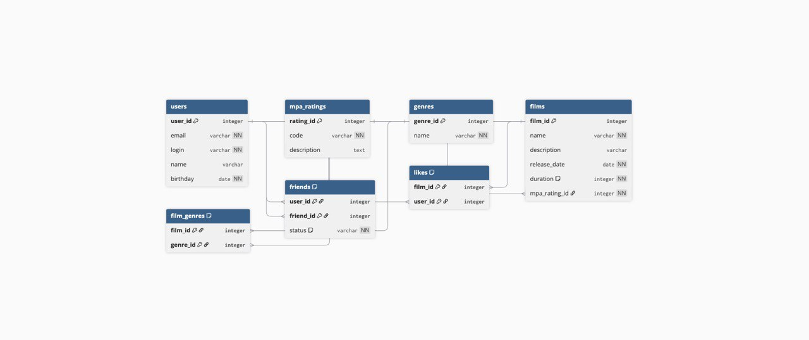

# java-filmorate

Приложение для управления фильмами и пользователями.  
Позволяет добавлять фильмы, ставить лайки, дружить с другими пользователями.

## ER-диаграмма

Схема базы данных:

### Пояснение к схеме:
- **users** — пользователи
- **films** — фильмы с описанием, датой, длительностью
- **mpa_ratings** — возрастной рейтинг (G, PG, PG-13 и т.д.)
- **genres** — жанры фильмов
- **film_genres** — связь " многие-ко-многим " между фильмами и жанрами
- **friends** — дружба с подтверждением (`UNCONFIRMED` / `CONFIRMED`)
- **likes** — лайки фильмов пользователями

